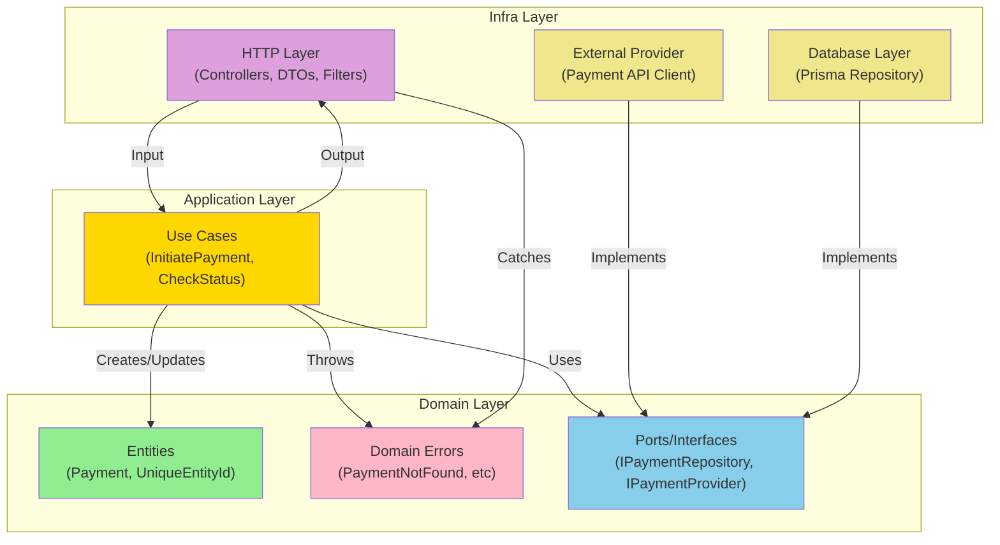
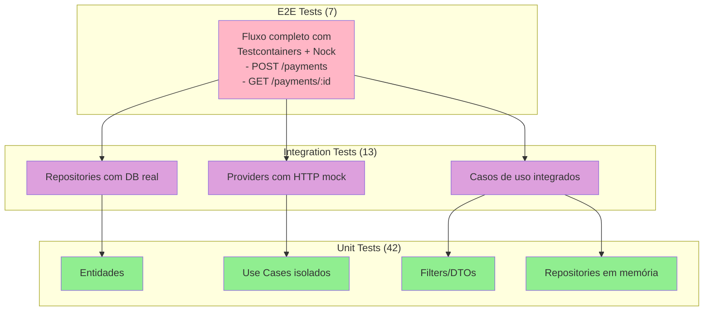
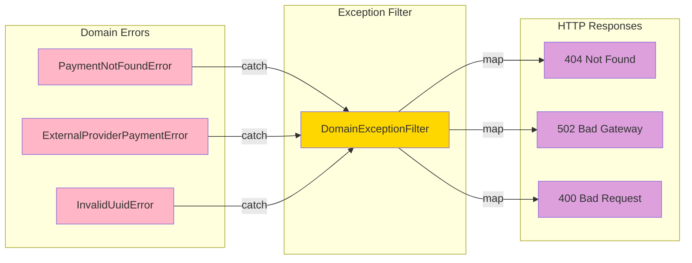
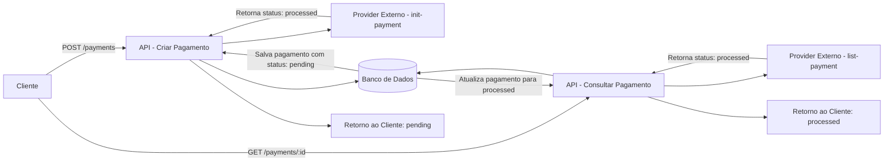
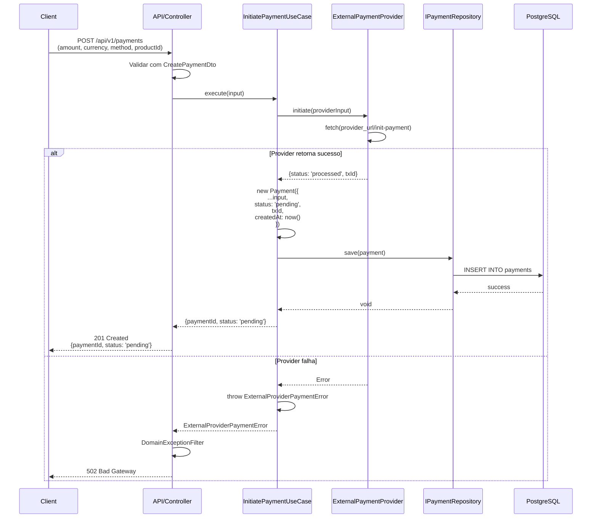
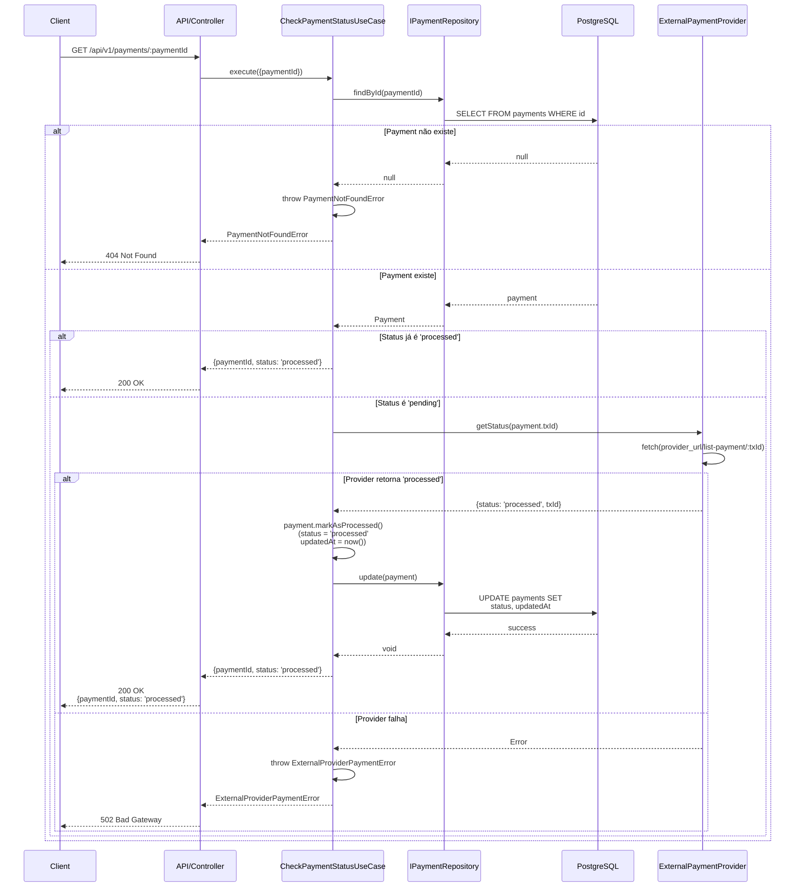
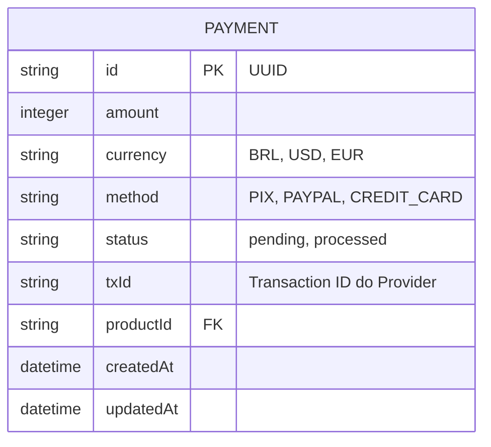
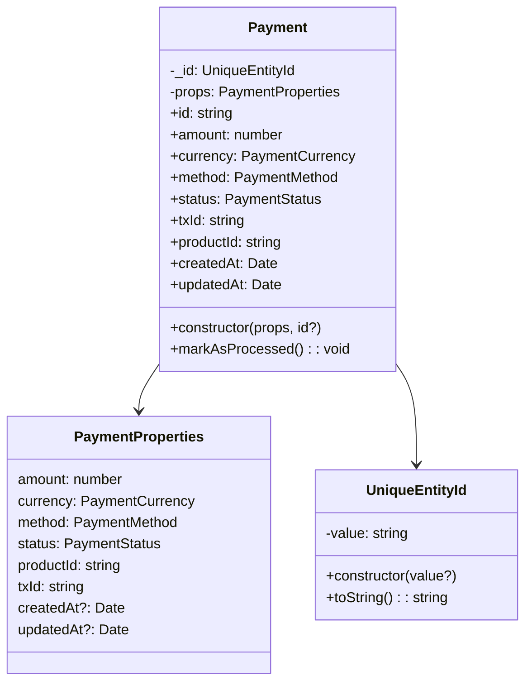

<p align="center">
  
  
  
  
  
  
</p>


# Payment API - Cartwave (Desafio Técnico)

API RESTful para processamento de pagamentos desenvolvida como solução para desafio técnico. A API foi construída com NestJS, Prisma e Arquitetura Hexagonal, com foco em organização, testabilidade e desacoplamento.

- ✅ Organização seguindo boas práticas e padrões de projeto
- ✅ Arquitetura Hexagonal
- ✅ **100% de cobertura de testes**
- ✅ Testes de integração com Testcontainers (banco real) e Nock (provider mockado)
- ✅ Documentação completa da solução e decisões técnicas

## 📋 Sobre o Projeto

Esta API permite iniciar solicitações de pagamento e verificar o status de pagamentos através de integração com um provedor externo fictício. O projeto foi desenvolvido com foco em:

- Arquitetura definida
- Alta testabilidade
- Baixo acoplamento
- Separação clara de responsabilidades
- Cobertura total de testes

### 🚀 Funcionalidades

- **Iniciar Pagamento** (`POST /api/v1/payments`): Envia requisição ao provedor externo e registra o pagamento como *pending*
- **Consultar Status** (`GET /api/v1/payments/:paymentId`): Consulta o provider, atualiza banco e retorna status *processed*
- **Validação de entrada**: DTOs com class-validator para garantir dados válidos
- **Exception Filters**: Mapeamento automático de erros de domínio para HTTP responses apropriadas
- **Type-safety**: escrito 100% TypeScript

## 🏗️ Arquitetura

O projeto segue os princípios da **Arquitetura Hexagonal** (Ports and Adapters), separando claramente as responsabilidades:

- **Domain** (Core): Contém as regras de negócio puras, independente de frameworks, banco de dados ou serviços externos
- **Application**: Casos de uso que orquestram o domínio
- **Infra**: Implementações concretas (HTTP, Banco de dados, Providers externos)

Esta separação permite:

- **Testabilidade máxima**: Mock fácil de providers e repositórios sem afetar o domínio
- **Flexibilidade**: Trocar banco de dados ou provider externo sem impactar regras de negócio
- **Manutenibilidade**: Código claro com responsabilidades bem definidas

```
src/
├── core/                                           # Núcleo da aplicação (independente de framework)
│   ├── domain/
│   │   ├── entities/                               # Entidades de domínio
│   │   ├── errors/                                 # Erros de domínio
│   │   └── ports/                                  # Interfaces (contratos)
│   └── application/
│       └── usecases/                               # Casos de uso da aplicação
│
├── infra/                                          # Implementações de infraestrutura
│   ├── db/
│   │   ├── prisma/                                 # Repositório Prisma + Service
│   │   └── in-memory-payment.repository.ts         # Repositório em memória (testes)
│   ├── http/
│   │   ├── controllers/                            # Controllers HTTP
│   │   ├── dtos/                                   # Data Transfer Objects
│   │   └── filters/                                # Exception Filters
│   └── providers/                                  # Integrações externas
│
├── app.module.ts
└── payment.module.ts
```

### Diagrama de Arquitetura em Camadas



## 🎯 Decisões Técnicas

### Arquitetura Hexagonal

A arquitetura hexagonal foi escolhida porque:

1. **Desacoplamento**: O domínio (regras de negócio) não conhece frameworks, banco de dados ou serviços externos.
2. **Testabilidade**: Com interfaces (ports) definindo contratos, atingimos testabilidade máxima com mocks eficientes.
3. **Manutenibilidade**: Mudanças em infraestrutura (trocar banco, mudar provider) não afetam as regras de negócio.
4. **Escalabilidade**: Fácil adicionar novos adapters (repositórios, providers) sem modificar o core.

### NestJS

1. **Injeção de Dependência nativa**: Facilita a implementação da arquitetura hexagonal
2. **Modularidade**: Organização clara em módulos
3. **TypeScript first**: Type-safety em todo o projeto
4. **Ecossistema maduro**: Validação (class-validator), filtros de exceção, lifecycle hooks
5. **Integração com testes**: Jest nativo com suporte a mocks
6. **Community robusta**: Muito usado em produção, boas práticas bem estabelecidas

### Prisma

1. **Type-safety**: Queries tipadas, erros em tempo de compilação
2. **Migrations**: Versionamento automático com schema do banco
3. **Adapter pattern**: Permite usar diferentes drivers (PostgreSQL, MySQL, etc)
4. **DX (Developer Experience)**: Prisma Studio, CLI intuitivo
5. **Performance**: Queries otimizadas com suporte a raw queries quando necessário

### Erros de Domínio + Exception Filters

Os erros de domínio (`PaymentNotFoundError`, `ExternalProviderPaymentError`) são classes puras que não dependem da infra, HTTP ou framework:

```typescript
// Erro de domínio - puro, sem framework
export class PaymentNotFoundError extends Error {
  constructor(id: string) {
    super(`Payment with id ${id} not found`);
  }
}
```

O domínio permanece puro e o mapeamento para HTTP fica centralizado. O `DomainExceptionFilter` na camada de infraestrutura só então traduz esses erros para respostas HTTP apropriadas:

| Erro de Domínio | HTTP Status |
|-----------------|-------------|
| `PaymentNotFoundError` | 404 Not Found |
| `ExternalProviderPaymentError` | 502 Bad Gateway |
| `InvalidUuidError` | 400 Bad Request |


## 🧪 Estratégia de Testes

### Pirâmide de Testes



Implementamos a **pirâmide de testes** de Mike Cohn, com distribuição equilibrada:

| Nível | Objetivo | Ferramentas | Velocidade | Quantidade |
|-------|-------------|-------------|------------|------------|
| **E2E** | Fluxo completo | Supertest + Testcontainers + Nock | 🐢 Lento | 7 testes |
| **Integração** | Componentes juntos | Testcontainers + Nock | ⚠️ Médio | 13 testes |
| **Unitários** | Lógica isolada | Jest + Mocks | ⚡ Rápido | 42 testes |

**Total**: 64 testes com **100% de cobertura** em todas as métricas (statements, branches, functions, lines)

### Testcontainers

1. **Banco real**: Testa com PostgreSQL real, não com mocks ou SQLite para testes
2. **Isolamento**: Cada suite cria seu próprio container isolado
3. **CI/CD friendly**: Funciona em qualquer ambiente com Docker
4. **Confiabilidade**: Detecta problemas que mocks podem não detectar

### Nock

1. **Mock HTTP**: Intercepta requisições HTTP para o provider externo
2. **Determinístico**: Controla totalmente as respostas simulando o provider
3. **Sem servidor fake**: Não precisa subir servidor mockado
4. **Especificação clara**: Testa exatamente a interface esperada do provider

### Jest + SWC

Jest é o test runner nativo do NestJS. SWC é um compilador rápido em Rust que acelera significativamente os testes comparado ao TypeScript puro, mantendo compatibilidade total.

## 🚀 Tecnologias

- **Node.js** (v20+)
- **NestJS** (v10+)
- **TypeScript**
- **Prisma 7 + PostgreSQL** (PostgreSQL)
- **Jest + SWC** (Testes)
- **Testcontainers** (Testes de integração)
- **Nock** (Mock HTTP)
- **Docker** (Banco de dados)
- **Supertest**

## 📦 Instalação

### Pré-requisitos

- Node.js 20+
- Docker (para rodar o banco e testes de integração)
- npm, pnpm ou yarn

### Passos

1. Clone o repositório:
```bash
git clone <url-do-repositorio>
```

2. Instale as dependências (o `npm install` executa automaticamente `prisma generate` via `postinstall`):
```bash
npm install
```

3. Configure as variáveis de ambiente:
```bash
cp .env.example .env
```

Certifique-se de configurar:
- `DATABASE_URL`: URL de conexão com PostgreSQL
- `PAYMENT_PROVIDER_URL`: URL do provider externo (ex: http://localhost:3001)

4. Inicie o banco de dados:
```bash
npm run docker:up
```

5. Execute as migrations:
```bash
npx prisma migrate dev
```

6. Inicie a aplicação:
```bash
npm run start:dev
```

A aplicação estará disponível em `http://localhost:3000`

## ⚙️ Variáveis de Ambiente

| Variável | Descrição |
|----------|-----------|
| `PORT` | Porta de exposição da aplicação |
| `DATABASE_URL` | URL de conexão com PostgreSQL |
| `PAYMENT_PROVIDER_URL` | URL do provedor de pagamentos externo |

## 📡 Endpoints

### Iniciar Pagamento

```http
POST /api/v1/payments
Content-Type: application/json

{
  "amount": 1234,
  "currency": "BRL",
  "method": "PAYPAL",
  "product_id": "5b5fef7e-f8a5-434c-b5f3-a721f12c50fc"
}
```

**Resposta (201):**
```json
{
  "paymentId": "uuid",
  "status": "pending"
}
```

### Consultar Status

```http
GET /api/v1/payments/:paymentId
```

**Resposta (200):**
```json
{
  "paymentId": "f8d077f4-d0b8-4e82-808f-51ca0ffef2e1",
  "status": "processed"
}
```

### Códigos de Erro

| Código | Descrição |
|--------|-----------|
| `400` | Dados inválidos (validação) |
| `404` | Pagamento não encontrado |
| `502` | Erro no provedor externo |



## 🧪 Execução dos Testes

### Executar todos os testes e medir cobertura
```bash
npm run test:cov
```

### Testes unitários
```bash
npm run test:unit
```

### Testes de integração
```bash
npm run test:int
```

### Testes E2E
```bash
npm run test:e2e
```

### Cobertura Final

O projeto atinge **100% de cobertura** em todas as métricas:

```
-------------------------------------|---------|----------|---------|---------|
File                                 | % Stmts | % Branch | % Funcs | % Lines |
-------------------------------------|---------|----------|---------|---------|
All files                            |     100 |      100 |     100 |     100 |
-------------------------------------|---------|----------|---------|---------|
```

## 🔄 Fluxo de Pagamento



### Iniciar pagamento



### Consultar pagamento



## 🔄 Modelagem de Entidades e Dado

### Modelo Entidade-Relacionamento no Banco de Dados



### Modelo das Entidades da camada de domínio



## 📁 Scripts Disponíveis

| Script | Descrição |
|--------|-----------|
| `npm run start:dev` | Inicia em modo desenvolvimento |
| `npm run build` | Compila o projeto |
| `npm run test:unit` | Executa testes unitários |
| `npm run test:int` | Executa testes de integração |
| `npm run test:e2e` | Executa testes E2E |
| `npm run test:cov` | Executa todos os testes com cobertura |
| `npm run docker:up` | Inicia o docker da aplicação com o Banco de Dados |
| `npm run docker:down` | Para o docker da aplicação com o Banco de Dados |

## 🛠️ Espaço de Melhorias

- [ ] Webhook para notificações do provider
- [ ] Implementar retry com exponential backoff para falhas do provider
- [ ] Swagger/OpenAPI para documentação interativa
- [ ] Rate limiting para proteção de API
- [ ] Logging estruturado (Winston ou Pino)
- [ ] Metrics e tracing (Prometheus/OpenTelemetry)

## 👤 Autor

André Luiz - Desafio Técnico Cartwave

---
